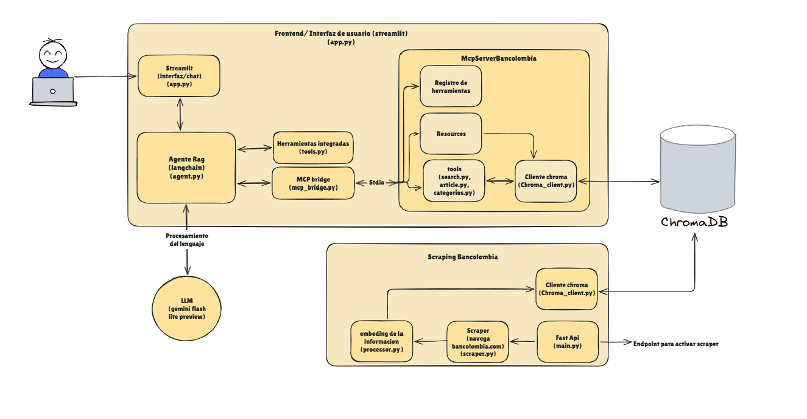

# 🏦 Sistema RAG Bancolombia - Asistente Conversacional Inteligente
Asistente virtual basado en arquitectura Retrieval-Augmented Generation (RAG) diseñado para responder preguntas sobre productos y servicios del Grupo Bancolombia.

El sistema es capaz de extraer información de la web oficial, vectorizarla, y exponerla a través de un Asistente Virtual Inteligente (LLM) utilizando una arquitecturamodular y basada en el protocolo estándar **MCP (Model Context Protocol)**.

## 🏗️ Arquitectura y Estructura del Proyecto

El proyecto está dividido en tres microservicios principales, diseñados bajo principios de alta cohesión y bajo acoplamiento:

```text
rag-agent-bancolombia-tech-test/
├── 📁 AgentBancolombia/       # [Frontend y Orquestador IA]
│   ├── 📁 src/
│   │   ├── agent.py            # (Definición del Agente RAG, LLM y lógica de enrutamiento)
│   │   ├── mcp_bridge.py       # (Puente de comunicación stdio entre el Agente y el Servidor MCP)
│   │   └── tools.py            # (Definición de las herramientas expuestas a LangChain)
│   ├── app.py                  # (Aplicación principal e interfaz gráfica construida con Streamlit)
│   ├── README.md               # (Documentación específica de la arquitectura del Agente)
│   └── requirements.txt        # (Librerías requeridas para el agente: langchain, streamlit, etc.)
│
├── 📁 McpServerBancolombia/   # [Capa de Datos y Herramientas]
│   ├── 📁 app/
│   │   ├── 📁 resources/       
│   │   │   └── stats.py        # (Endpoint de solo lectura que expone estadísticas de la base vectorial)
│   │   ├── 📁 tools/           
│   │   │   ├── article.py      # (Herramienta para extraer el contenido exacto de un producto vía URL)
│   │   │   ├── categories.py   # (Herramienta para explorar el catálogo de categorías y productos)
│   │   │   └── search.py       # (Motor principal de búsqueda semántica sobre ChromaDB)
│   │   ├── chroma_client.py    # (Cliente Singleton para conectar a ChromaDB y gestionar embeddings)
│   │   └── main.py             # (Punto de entrada de FastMCP, registra herramientas e inicia el servidor)
│   ├── README.md               # (Documentación del protocolo MCP y capacidades del servidor)
│   └── requirements.txt        # (Librerías requeridas para el servidor MCP: fastmcp, chromadb, etc.)
│
├── 📁 ScrapingBancolombia/    # [Motor de Ingesta]
│   ├── 📁 app/
│   │   ├── main.py             # (Punto de entrada de FastAPI para orquestar la extracción de datos)
│   │   ├── processor.py        # (Lógica de limpieza de texto, chunking y vectorización para ChromaDB)
│   │   └── scraper.py          # (Lógica de navegación y extracción de HTML usando Playwright)
│   ├── README.md               # (Documentación técnica del pipeline de scraping e ingesta)
│   ├── Dockerfile              # (Receta de contenedor aislada para el microservicio de scraping)
│   └── requirements.txt        # (Librerías requeridas para scraping: fastapi, playwright, bs4, etc.)
│
├── 📁 chroma_backup/          # Copia de seguridad pre-cargada de la base vectorial (Persistencia local)
├── 📄 docker-compose.yml      # Orquestador global de contenedores, redes y volúmenes
└── 📄 Dockerfile              # Empaquetado unificado (servicio de scrapin, Agente + Servidor MCP compartiendo entorno)
```

* **Diagrama de arquitectura**



### 🧠 Decisión Arquitectónica Destacada (Transporte `stdio`)

Para cumplir con el estándar MCP de forma segura, el **Agente** y el **Servidor MCP** comparten el mismo contenedor de Docker (`Dockerfile` en la raíz). Esto permite que el Agente levante el servidor de forma aislada mediante la salida estándar (`stdio`), evitando exponer puertos HTTP innecesarios para las consultas de la base de conocimiento, y manteniendo el microservicio de Scraping completamente independiente.

---

## ⚙️ Variables de Entorno

Para que el sistema funcione, es necesario exportar la clave de la API de Google Gemini directamente en tu sesión de terminal antes de levantar los contenedores. Por motivos de seguridad y mejores prácticas, este proyecto no utiliza un archivo `.env` físico para la inyección de credenciales.

### Obligatorias 🔴
* `GOOGLE_API_KEY`: Clave de acceso a la API de Gemini (Google AI Studio). Sin esta clave, el Agente y el reescritor de consultas no funcionarán.

### Opcionales / Gestionadas por el Sistema 🟢
*Estas variables ya están configuradas por defecto en el `docker-compose.yml`.*

* `CHROMA_HOST`: Nombre del contenedor o IP de ChromaDB (Default: `chromadb-server`).
* `CHROMA_PORT`: Puerto de conexión a ChromaDB (Default: `8000`).
* `MAX_PRODUCTOS_A_GUARDAR`: Límite de productos a extraer durante el scraping. Se usa para pruebas rápidas. (Default: `-1` para extraer todo).

---

## 🛠️ Mejoras Futuras

Con el objetivo de seguir escalando y optimizando el proyecto, se proponen las siguientes áreas de mejora continua:

* **Refinamiento del Scraping:** Añadir más condicionales en el motor de ingesta para identificar de forma más precisa los productos específicos que ofrece Bancolombia. Esto garantizará una mayor limpieza y estructuración de la data antes de ser almacenada vectorialmente en la base de datos.
* **Optimización del Procesador de Embeddings:** Implementar variables de entorno en el procesador encargado de los embeddings para centralizar la configuración. Además, descargar y almacenar directamente el modelo de embeddings en el repositorio (o en un volumen persistente) evitará la descarga redundante cada vez que se levanta el servidor MCP o se genera un embedding, mejorando drásticamente los tiempos de inicio en especial para modelos mas pesados.
* **Agnosticidad de Modelos (LLMs):** Desarrollar la capacidad en el Agente para integrarse fácilmente con LLMs de distintas compañías (como OpenAI, Anthropic, etc.), expandiendo las opciones más allá de la integración actual exclusiva con Gemini.
* **Eficiencia de Tokens:** Implementar técnicas de Caveman Prompting para reducir el consumo de tokens y, en consecuencia, optimizar los costos.
* **Gestión Segura de Secretos:** Integrar un sistema de gestión de secretos (como AWS Secrets Manager, GitHub Secrets, etc.) para inyectar credenciales y llaves de acceso de forma segura en entornos productivos, evitando el paso de las mismas por medios no seguros como correos electrónicos.
* **Evolución a LangGraph:** Migrar la orquestación del flujo conversacional de LangChain a LangGraph. Esto permitirá construir un sistema mucho más robusto, manejando ciclos complejos y teniendo un control semántico mucho más fino y determinista sobre cuándo y cómo el agente decide utilizar cada herramienta disponible.
* **Optimización en consulta a la db:** Actualmente, la consulta de categorías y recursos se realiza mediante un escaneo total de la base de datos y eliminación de duplicados. Dado el volumen actual de productos, esta solución es funcional; sin embargo, representa una oportunidad de mejora técnica para optimizar el rendimiento a medida que la base de datos crezca.
* **Scraper:** Actualmente, el scraper almacena los datos en memoria antes de generar los embeddings, lo cual compromete la escalabilidad al procesar volúmenes masivos de páginas. Como mejora, se propone una arquitectura de procesamiento directo hacia la base de datos o el uso de un almacenamiento intermedio en Amazon S3 para desacoplar la extracción de la transformación.

## 🚀 Despliegue y Ejecución

El proyecto está 100% dockerizado. Para facilitar la evaluación, se proveen scripts de despliegue que manejan la preparación de los volúmenes de datos automáticamente.

### Prerrequisitos
* Docker y Docker Compose instalados.
* Git.
* Una clave API de Google Gemini.

### Paso 1: Configuración
Clona el repositorio y configura tus variables de entorno:

##bash
```bash
git clone https://github.com/YersonZapata/rag-agent-bancolombia-tech-test
cd rag-agent-bancolombia-tech-test
export GOOGLE_API_KEY="tu_clave_de_gemini_aqui"
docker compose up -d --build
o
podman compose up -d --build
```

##PowerShell
```PowerShell
git clone https://github.com/YersonZapata/rag-agent-bancolombia-tech-test
cd rag-agent-bancolombia-tech-test
$env:GOOGLE_API_KEY="tu_clave_de_gemini_aqui"
docker compose up -d --build
o
podman compose up -d --build
```

Para interactuar con el chat, entrar a http://localhost:8501/