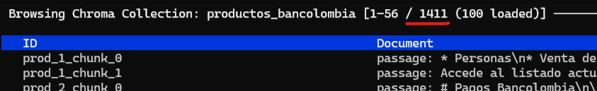
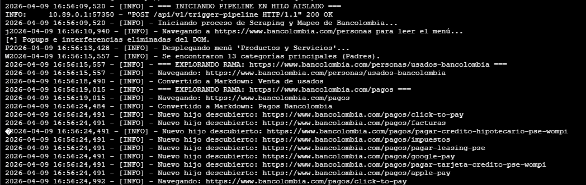
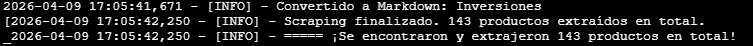
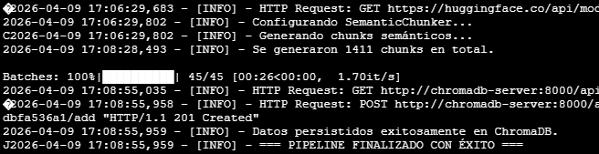

# 🕸️ ScrapingBancolombia - Microservicio RAG

Este microservicio es el motor de ingesta y búsqueda para el sistema RAG (Retrieval-Augmented Generation) de productos de Bancolombia. 

Se encarga de navegar dinámicamente por la página web del banco, extraer la información de los productos, limpiarla (convirtiéndola a Markdown), segmentarla y guardarla como vectores en una base de datos ChromaDB para su posterior recuperación semántica.

## 🚀 Tecnologías Principales

* **Framework API:** FastAPI (Python), para levantar un servicio post que ejecute el pipeline de ejecución del scraping.
* **Scraping:** Playwright (Asíncrono con emulación de navegador Chromium).
* **Procesamiento de Texto:** Markdownify y LangChain (SemanticChunker para segmentación basada en contexto)
* **Embeddings:** Modelo `intfloat/multilingual-e5-small` (SentenceTransformers), usado por su soporte multilenguaje, bajo costo (se puede ejecutar sin problemas en cpus) y baja latencia, lo cual es importante tenerlo en cuenta si vamos a correr el modelo en local.
* **Base de Datos Vectorial:** ChromaDB, por defecto la colección se llama "productos_bancolombia"
* **Contenerización:** Podman / Docker

### 🧠 Justificación de la Estrategia de Embedding e Indexación

Para este sistema RAG de productos financieros, se implementó una estrategia que prioriza la **integridad semántica** y la **eficiencia operativa**. A continuación, se detallan los pilares de esta elección:

#### 1. Segmentación Semántica (Semantic Chunking)
A diferencia de los métodos de partición fija por caracteres o palabras, se utilizó un **`SemanticChunker`** para garantizar la coherencia del contenido:
*   **Preservación de la Unidad Lógica:** El algoritmo detecta cambios en el significado del texto (ej. transiciones entre tasas de interés y términos legales). Esto evita que mensajes queden huérfanos de su contexto, asegurando que cada *chunk* contenga una idea de negocio completa.
*   **Segmentación Dinámica vs. Estática:** Se configuró un **umbral de percentil 85**. Esto significa que el sistema solo fragmenta el texto cuando la diferencia semántica entre oraciones se encuentra en el 15% de los cambios más drásticos del documento. Esta valla alta preserva la integridad de párrafos financieros complejos, evitando particiones arbitrarias que degradarían la precisión del modelo en la fase de respuesta.

#### 2. Modelo: `intfloat/multilingual-e5-small`
Se seleccionó este modelo específico por su rendimiento superior en entornos multilingües y su arquitectura optimizada:
*   **Entrenamiento por Contraste Débil (Weakly-supervised):** A diferencia de modelos genéricos, la familia E5 está diseñada específicamente para tareas de recuperación (*retrieval*), superando a otros modelos en la identificación de documentos relevantes.
*   **Estrategia de Instrucciones (Prefixes):** El modelo utiliza prefijos técnicos (`query:` para la búsqueda y `passage:` para el almacenamiento). Esta distinción permite que el motor de búsqueda entienda cuándo está comparando una pregunta corta de un usuario frente a un documento técnico denso, maximizando la relevancia de los resultados.
*   **Eficiencia y Escalabilidad:** Genera vectores de **384 dimensiones**. En comparación con modelos como `BGE-M3` (1024 dimensiones), el `e5-small` ofrece una precisión competitiva con una reducción del **60% en el consumo de memoria y latencia**. Esto permite una búsqueda vectorial más rápida y económica sin sacrificar la calidad de la respuesta.

#### 3. Optimización de la Indexación
La implementación en la base de datos vectorial incluye:
*   **Trazabilidad de Datos:** Cada vector se indexa con metadatos de auditoría (ID del producto, categoría y fecha de actualización).
*   **Consistencia Técnica:** Se utiliza el mismo modelo de embeddings tanto para la segmentación inicial como para la consulta en tiempo real, garantizando que la "lógica de comprensión" del sistema sea uniforme en todo el pipeline del RAG.

#### 🔗 Referencias y Documentación
*   [Elastic Search Labs: Multilingual vector search with E5 embedding model](https://translate.goog) - Análisis sobre el rendimiento y arquitectura de los modelos E5 en entornos multilingües.

---

## ⚙️ Variables de Entorno

El servicio está diseñado para ser configurado a través de variables de entorno. En el entorno de producción o al usar `docker-compose`, se pueden inyectar las siguientes variables:

| Variable | Descripción | Valor por Defecto |
| :--- | :--- | :--- |
| `MAX_PRODUCTOS_A_GUARDAR` | Límite máximo de productos a extraer por ejecución. Usa `-1` para extracción ilimitada, el scraping solo navega el menu de productos y servicios de la pagina de Bancolombia, el scraping dura aproximadamente 10 min, pero el embedding puede durar otros 10 minutos mas dependiendo de la maquina| `-1` |
| `CHROMA_HOST` | Nombre del host o contenedor donde vive el servidor de ChromaDB. | `chromadb-server` |
| `CHROMA_PORT` | Puerto de conexión para el servidor de ChromaDB. | `8000` |

MAX_PRODUCTOS_A_GUARDAR, CHROMA_HOST y CHROMA_PORT no son obligatorios ya que tiene valores por defecto si se usa la db que se levanta de manera local
---

## 🏗️ Cómo ejecutar el proyecto (Vía Contenedores)
Este microservicio está diseñado para vivir dentro de un ecosistema orquestado. El archivo `docker-compose.yml` principal se encuentra en la **raíz del proyecto** (un nivel arriba de esta carpeta).

Para levantar toda la infraestructura (Base de datos + API de Scraping):

1. Abre tu terminal y ubícate en la raíz del repositorio (`rag-agent-bancolombia-tech-test`).
2. Ejecuta el orquestador usando Podman (o Docker):

```bash
podman compose up -d --build
```
3. Para levantar solo el proyecto del scraping es necesario tener la chromadb arriba en el puerto 8000 ejecutar el siguiente comando para levantar el servicio en el puerto 8001 

```bash
uvicorn app.main:app --port 8001 --reload
```


## 🔌 Endpoints Disponibles

El microservicio expone los siguientes endpoints para interactuar con el motor de ingesta y búsqueda:

### 1. Iniciar Ingesta
`POST localhost:8001/api/v1/trigger-pipeline`

Dispara el proceso de scraping y guardado en la base de datos vectorial de forma asíncrona.
*   **Funcionamiento:** Ejecuta el pipeline de scraping en segundo plano.
*   **Logs:** Para monitorear el progreso detallado, es necesario entrar a la consola del pod/contenedor y visualizarlos en tiempo real.
*   **Cuerpo (Body):** No requiere parámetros.

### 2. Búsqueda Rápida (Pruebas)
`POST localhost:8001/api/v1/search`

Permite realizar consultas semánticas directas sobre **ChromaDB** para validar que la información se haya indexado correctamente y jugar un poco con la db.

*   **Cuerpo (JSON):**
```json
{
  "query": "cuales son las caracteristicas del seguro de vida mas",
  "limit": 3
}
```
para navegar dentro de los datos de la chromadb en local usar 

```bash
chroma browse productos_bancolombia --local
```


## 💾 Precarga de Datos (Backup de Embeddings)

Dado que el proceso de scraping y embedding puede ser lento o fallar por cambios estructurales en la web de Bancolombia (como fue el caso esta semana que añadieron un popup justo al entrar en la web, fue corregido el error en el codigo), se ha incluido una copia de seguridad de los datos procesados que puede cargarse directamente en ChromaDB.

Sigue estos pasos para restaurar el backup:

**1. Copiar el contenido del backup al contenedor:**
```bash
podman cp "tu_ruta_local\chroma_backup\data\." chromadb-server:/data
```
**2. Asignar permisos sobre la ruta:**
```bash
podman exec -it chromadb-server chmod -R 777 /data
```
**3. Reiniciar el contenedor:**
```bash
podman restart chromadb-server
```

Si tienes instalado Chroma en tu sistema, puedes verificar los datos cargados ejecutando:

```bash
chroma browse productos_bancolombia --local
```


Entrar a http://localhost:8501/ para interactuar con el chat una vez la aplicación este lista.


## 📊 Resultados

**Segmentación**
El proceso de segmentación generó aproximadamente **1,411 chunks**, permitiendo una división granular de la información para optimizar la recuperación.



**Pipeline de scraping**
El flujo de trabajo automatizado se ejecutó de la siguiente manera:

*   **Extracción de datos:** El pipeline inició a las **16:56**, identificando correctamente las **13 categorías** de productos y servicios en el portal de Bancolombia. El sistema navegó de forma autónoma a través de los menús para recopilar la información técnica.
    

*   **Eficiencia del Scraping:** La extracción finalizó a las **17:05**, logrando recopilar **143 productos** en solo **9 minutos**. Acto seguido, se disparó el proceso de generación de embeddings.
    

*   **Indexación y Persistencia:** Se procesaron los chunks y se almacenaron en la base de datos vectorial, finalizando el ciclo completo a las **17:08**.
    

### ⚡ Optimización de Rendimiento
El tiempo total del proceso (scraping + embedding) fue de **12 minutos**, lo que representa una mejora significativa en la velocidad del modelo. 

Anteriormente, se utilizaba el modelo `BAAI/bge-m3`, el cual es considerablemente más pesado y extendía el tiempo de embedding hasta los **40 minutos**. Dado que las diferencias en precisión no eran determinantes para este caso de uso, se optó por el modelo **Small**, logrando un sistema mucho más ágil sin sacrificar calidad en las respuestas.
